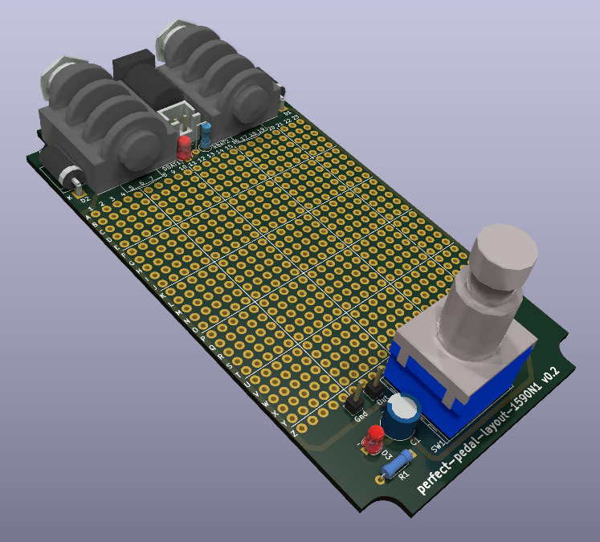
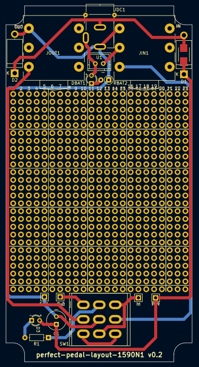
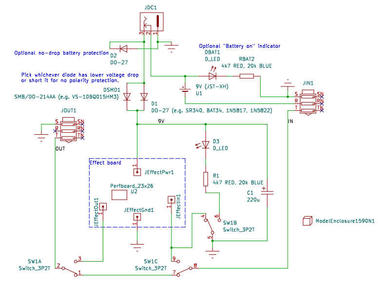

# perfect-pedal-layout
Perfect single-board guitar pedal layout for 1590N1 (125B) enclosure

# Goals

- all on one board
- no off-board wiring, ribbon cables, or board connectors
- top mounted jacks and standard DC barrel jack
- easy insertion into enclosure
- works both with through hole and SMD components
- only standard and available parts
- no oval holes in enclosure

# Results

Directory "kicad" contains Kicad project with the PCB including 3D models.
You can also install included footprints and symbols library.
This is how it looks like:

# Components

- 6.35mm stereo jack [PJ-609BA](https://lcsc.com/product-detail/Audio-Connectors_HOOYA-PJ-609BA_C309277.html)
  Note: you can only use these style of jacks where metal nut is inserted from the outside, if you use other variant where 
  nut goes over the barrel, like [this one](https://lcsc.com/product-detail/image/PJ-609_C309274.html) you will have trouble 
  inserting PCB into enclosure! With PJ-609BA the PCB goes straight into enclosiure, not rotating, moving in two directions, 
  just straight up.

- Standard DC barrel jack [DC-005 2.0](https://lcsc.com/product-detail/DC-Power-Connectors_BOOMELE-Boom-Precision-Elec-DC-005-2-0_C16214.html)

- Standard 3PDT stomp switch, just search "3PDT pedal switch" on aliexpress

- Optional polarity protection diodes, optional LED indicator diodes, resistors, caps.

- Optional internal battery connector via 2pin JST-XH connector.

# Notes

- Pots used in the demo above are AlpsAlpine RK097 on a perfboard daugterboards
- RK097 (in mono variant) are notable in that they can fit above the jacks thus leaving even more space in the middle, but they would not fit above jacks in 1590B enclosure!
- When using perfboard variant you can symmetrically place 2,3 or 4 RK097 pots in a row
- You can also use "Alpha pots" (WH148) but then only will 3 fit in a row
- You can also use long-shaft pots or long leg pots but they are bit harder to find and you will have less space for the components
- 125B is chinese name for knockoff 1590N1
- In 1590N1 the corners of jacks stick out 0.3mm which is fine, but in 1590B the stickout would be 2.3mm which is too much (you would have to use non-standard 2mm DC jack)